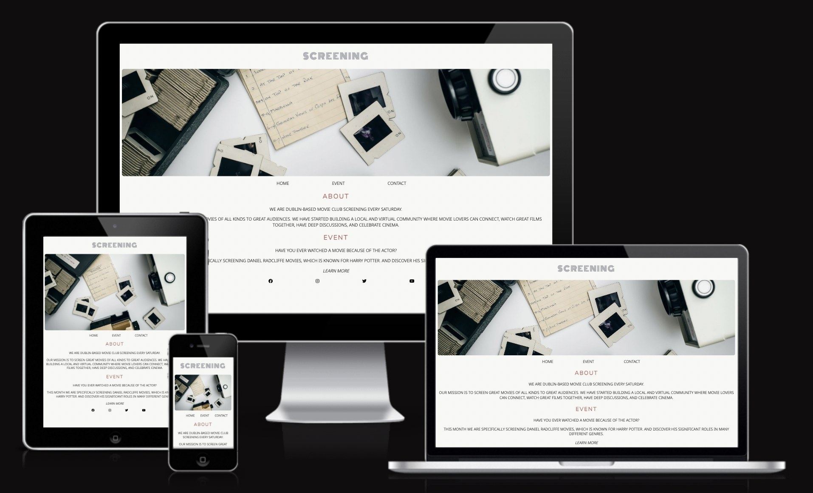
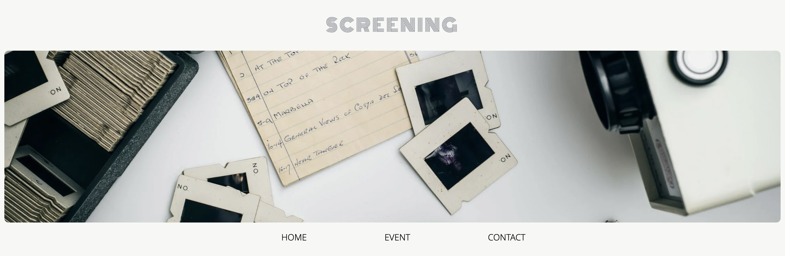
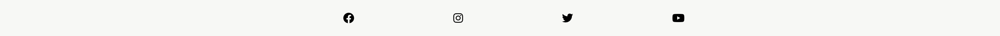
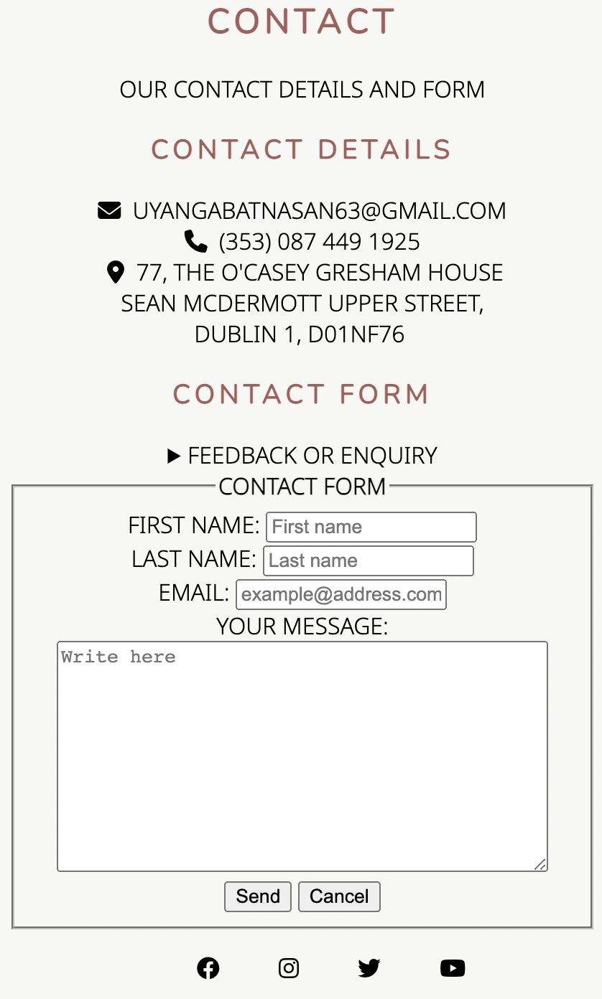
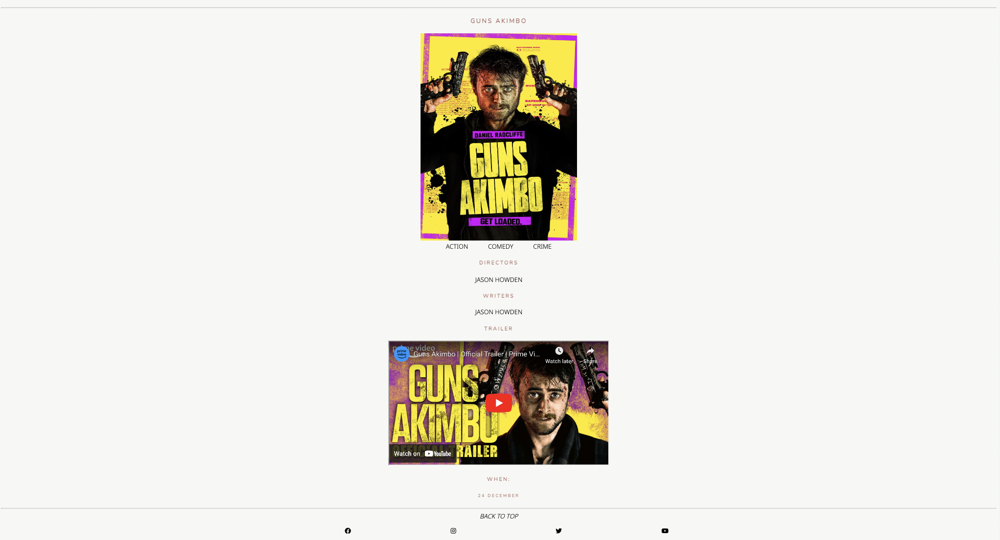
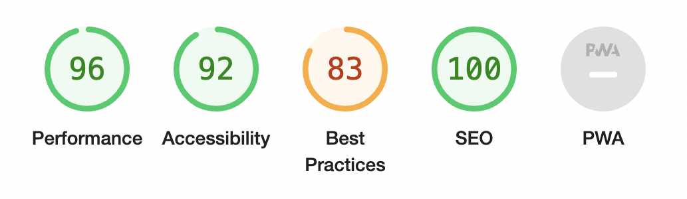

# Screening

A website is for a movie club called Screening. It is welcome for everyone who wish to participate in upcoming events. It is the first online movie club based in Dublin. The screening movie club stand for social cinema movement. They host movie events that contains introduction to director's work and the movie itself to give people better understanding of film..

Users of the website will be able to find all the information they need about the movie club: About the club, event location, time, upcoming screenings, contact information for enquiry or feedback. 

## Features
#### Header
- Heading One or Logo
  - It shows the club name.
  - Loacted in the top middle of every page.
  - Monoton font is used to attract user's attantion.
- Hero Image
  - Located under the logo.
  - Only shows in home page for design purpose.
  - It contrast with background color.

- Navigation
  - Feautured in header.
  - The links: Home, Event, Contact.
  - The navigation makes the different sections of information easy to find.

#### Footer
- The section includes social media icons to users can find the movie club on facebook, instagram, twitter and youtube.
- The color changes when it hovers to let users know it is a clickable.

#### Contact
- The contact page contains contact details and contact form.
- Contact details: email address, phone number and address.
- Contact form is for people who wish to send a message to us.

#### Event
- Event page contains event details including event date, time and embedded location.
- It also contains current event section for actor biography and current screening dates and further information for the movies.

## Testing
- I tested that thus page works in different browsers: Chrome, Safari.
- I confirmed that this project is responsive, looks good and functions on all standard screen sizes using the devtools device bar.
- I confirmed that the navigation, header, section, article, footer and contact text are all readable and easy to understand.
- I have confirmed that the form works: requires entries in every field, will only accept an email in the email field, and submit button works.
## Bugs
### Solved bugs
- When i validated my HTML i discovered embedded link contains an error. 
- It has outdated attribute called frameborder="0" and was removed.
## Validator Testing
- HTML
  - No errors were returned when passing through the official W3C validator
- CSS
  - No errors were found when passing through the official (Jigsaw) validator
- Accessibility
  - I confirmed that the colors and fonts chosen are easy to read and accessible by running it through lighthouse in devtools
 
 

## Unfixed Bugs
No unfixed bugs
## Deployment
- The site was deployed to GitHub pages. The steps to deploy are as follows:
 - In the GitHub repository, navigate to Settings tab
 - From the source section drop-down menu, select the Master Branch
 - Once the master branch has been selected, the page provided the link to the completed website.

The live link can be found here - [Screening](https://uyangabatnasann.github.io/screening/)

## Credits
### Content
- The article element contents were taken from [Wikipedia](https://www.wikipedia.com).
* Trailers were taken from [Youtube](https://www.youtube.com).
+ The icons in the footer were taken from [Font Awesome](https://www.fontawesome.com).
### Media
- The images resources are [Pexels](https://www.pexels.com), [Wikipedia](https://www.wikipedia.com), [IMDB](https://www.wikipedia.com).

